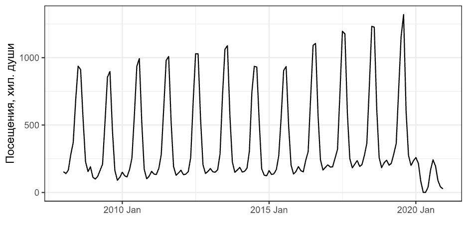
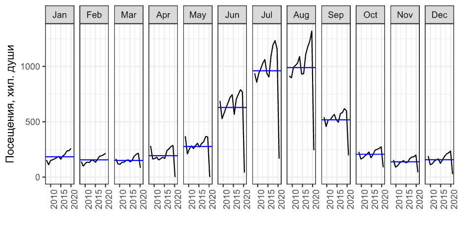
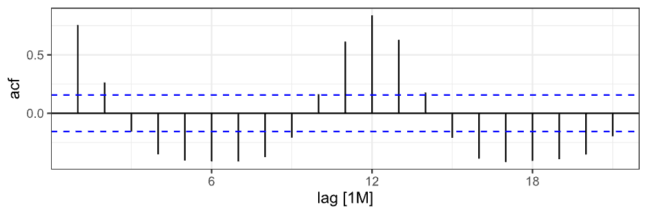
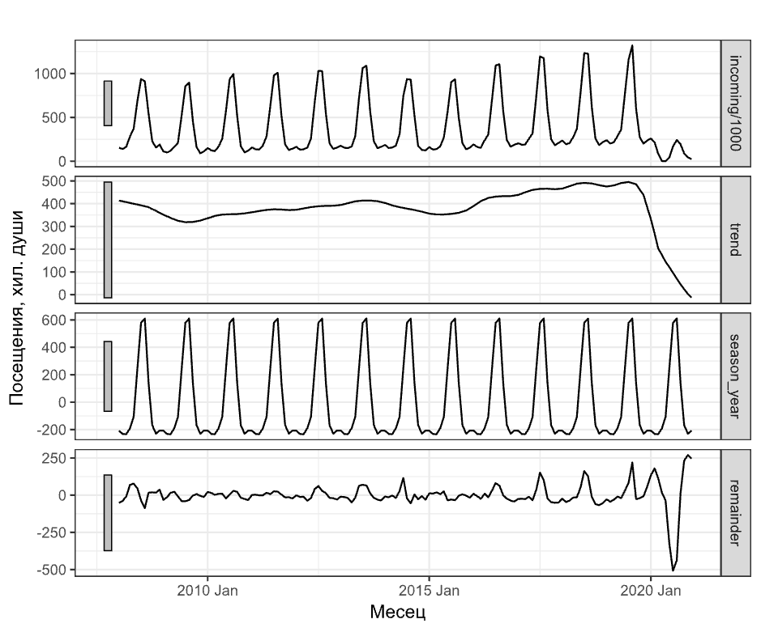
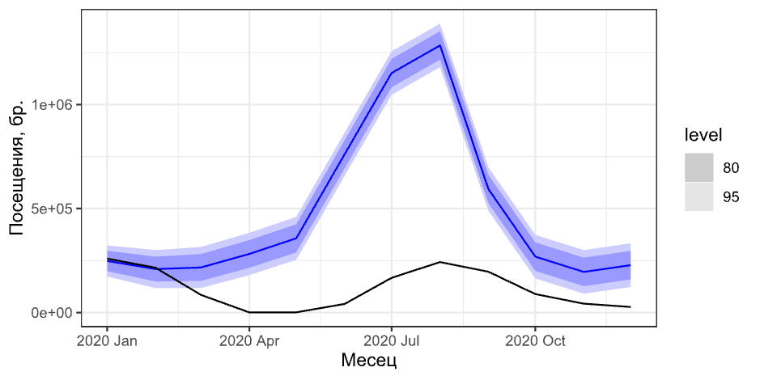

# Какво изследваме?

--

## Точната дефиниция на данните за туристически пътувания от категорията „Туризъм“ в НСИ е:

--

„посещения на чужденци в България с цел почивка и екскурзия“

--

и

--

„пътувания на български граждани в чужбина с цел почивка и екскурзия“.


---
class: inverse, center, middle

# Винаги е добре да визуализираме данните си!

---
# Посещения на чужденци в България

.center[]

--

Пиковете на посещенията на чужденци са основно в летните месеци юли и август;

--

за останалите месеци от годината е трудно да се открият такива.

---

# Месечата динамика може да се визуализира и по друг начин

.center[]

--

Така може да сме сигурни за това в кои месеци са пиковете на туристическите посещения.
---
# Сезонност и сезонно декомпозиране

"Систематична, но не винаги постоянна динамика, причинена директно от метеорологичното време, календара или вземането на решения на икономическите субекти."<sup>1</sup>

--

Математически, данните, характеризиращи се със сезонност, се дефинират така:

$$y_t=S_t+T_t+R_t$$

--

$y_t$ е елемент от времевия ред във време $t$, $S_t$ е сезонния компонент, $T_t$ е компонента на тренда и $R_t$ е остатъка. 

.footnote[
[1] S. Hylleberg, Seasonality in Regression, Orlando: Academic Press, 1986. 
]

---
# Сезонност и автокорелация

## Формална дефиниция

Когато данните имат изразена сезонност, трябва да се очаква, че автокорелацията между наблюденята $y_t$ и $y_{(t-s)}$ трябва да бъде по-висока от тази между наблюденията  $y_t$ и $y_{(t-k,k≠s)}$. 
--

.center[]


---

class: inverse, center, middle

# Сезонно декомпозиране
---

.center[]

---
# Моделиране и прогнозиране

Моделирането може да се направи с използването на  сезонен $ARIMA(p,d,q)(P,D,Q)m$ модел, където $p$ e степента на авторегресивния компонент, $d$ е степента на диференциране, $q$ е степента на пълзящата средна, като и трите се отнасят за несезонната част на модела. $P,D,Q$ са съответните степени на сезонния модел, и $m$ е броя на годишните наблюдения.

--

Избраният модел е $ARIMA(1,0,1)(0,1,2)12$. 

---
# Прогнозни и реални посещения на чуждестранни туристи в България за 2020 г.

.center[]

---
# Прогнозни и реални посещения
```{r, echo = FALSE}
library(tibble)
tourism <- read.csv2("/Users/victor/Documents/Projects/Tourism/tourism_data.csv")
knitr::kable(tourism)
```

---

background-image: url(pippin.jpg)
background-size: contain
background-position: 50% 50%
class: center, bottom, inverse

# You only live once!

---

class: center, middle

# Благодаря!

Слайдовете са създадени с пакета [**xaringan**](https://github.com/yihui/xaringan), с помощта на [remark.js](https://remarkjs.com), [**knitr**](https://yihui.org/knitr/), и [R Markdown](https://rmarkdown.rstudio.com).
